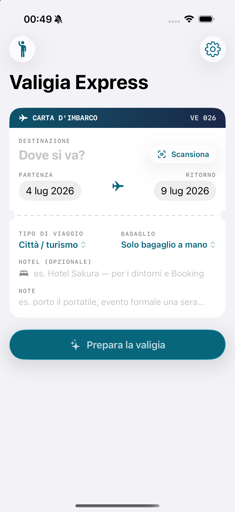
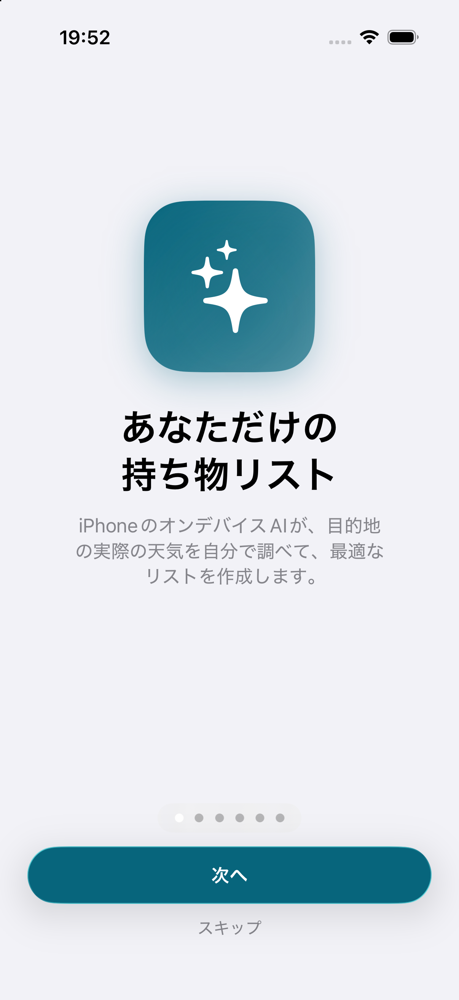

# 🧳 Valigia Express

> **La valigia si fa da sola. Beh, quasi.**

L'app iOS che prepara la lista valigia con l'intelligenza artificiale **on-device** del tuo iPhone — meteo vero della destinazione, consigli da persona del posto, timbri da collezione.

**🌐 Sito ufficiale e download: [matteoalbanesi79-commits.github.io/valigia-express](https://matteoalbanesi79-commits.github.io/valigia-express/)**

  
  
  

## ✨ Cosa sa fare

- **Lista su misura, AI on-device** — Apple Foundation Models: controlla il meteo reale e impara le tue abitudini. Funziona anche in aereo.
- **📷 Scanner carta d'imbarco** — inquadri il biglietto (IATA BCBP) e destinazione + date si compilano da sole
- **🗺️ Mappa che capisce** — rotta di volo animata, ricerca in linguaggio naturale ("posti nerd", "ramen"), attrazioni intorno al tuo hotel
- **🗣️ Guida vocale da local** — le parli, ti risponde a voce con i posti veri, non le trappole per turisti
- **📮 Temi per città** — Tokyo rosso carpa con la Tokyo Tower, Parigi blu notte: biglietto, timbri e sfondo a francobolli
- **🛂 Passaporto con timbri** — ogni viaggio lascia un timbro; lo tocchi e riapri quella valigia
- **🔊 A mani libere** — "Hey Siri, cosa metto in valigia?" anche da HomePod, Watch e CarPlay
- **✈️ Live Activity** — countdown e progresso valigia sulla Lock Screen e nella Dynamic Island
- **📡 Fatta per l'estero** — risparmio dati, cache offline, traduttore integrato. Parla 🇮🇹 🇬🇧 🇯🇵

## 🔒 Privata per design

| | |
|---|---|
| Account richiesti | **0** |
| Dati raccolti | **0** |
| Server e analytics | **0** |
| Peso totale | **~4 MB** |

Tutto gira sul dispositivo (Foundation Models, Speech, Translation). Le uniche richieste di rete sono verso [Open-Meteo](https://open-meteo.com) per meteo e geocoding — gratuite, senza API key.

## 📲 Installazione

- **TestFlight** — in arrivo
- **Sideloading** — scarica [`ValigiaExpress-1.1.ipa`](ValigiaExpress-1.1.ipa) (932 KB) e installala con [AltStore](https://altstore.io) o [Sideloadly](https://sideloadly.io). Istruzioni complete sul [sito](https://matteoalbanesi79-commits.github.io/valigia-express/#installa).

Requisiti: iOS 26+. Per la generazione AI serve un iPhone con Apple Intelligence (15 Pro o successivi).

## 🛠️ Com'è fatta

SwiftUI · Foundation Models (`@Generable` + tool calling) · MapKit · VisionKit · Speech & AVSpeechSynthesizer · Translation · ActivityKit & WidgetKit · App Intents · String Catalog (it/en/ja) · Liquid Glass (iOS 26)

---

Fatta con ☕️ da **Matteo Albanesi** · © 2026
